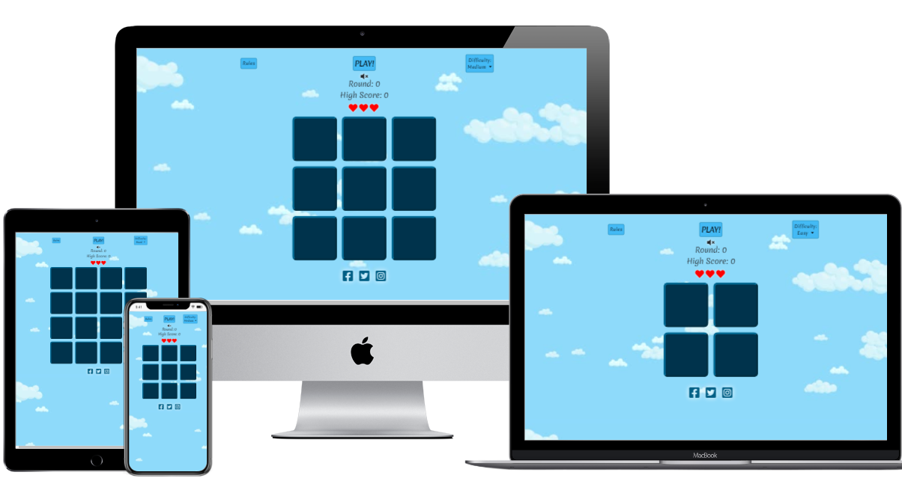
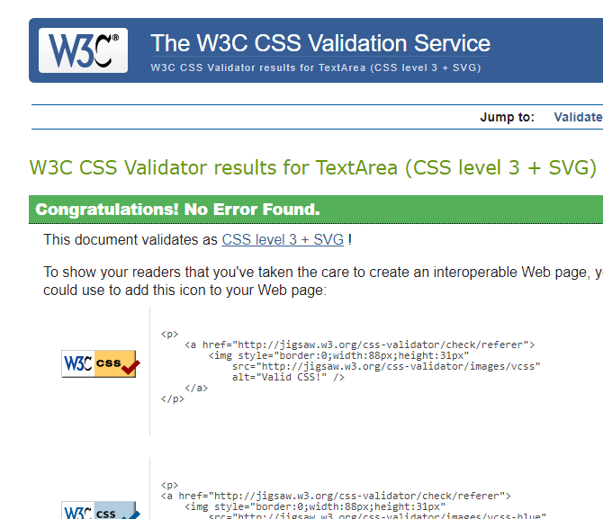

# Milestone Project 2 : Memory game

Link to main site [here](https://ellis-robinson.github.io/Memory-Game/) !
# Purpose

This is the second milestone project in my full stack development course. It is focusing on interactive frontend development utilising HTML, CSS and Javascript. 

I have created a simple memory game, where the user will be shown a flashing sequence and then have to repeat the sequence back to the game. The sequence will get progressively harder as the game continues.

# Contents

* [User Stories](#user-stories)

* [Design](#design)

    - [Wireframes](#wireframes)
    - [Color Scheme](#color-scheme)
    - [Typography](#typography)

* [Features](#features)

    - [Nav Section](#nav-section)
    - [Game Section](#game-section)
    - [Score Section](#score-section)

    - [Future features](#future-features)

* [Technologies](#technologies)

    - [Languages](#Languages)
    - [Libraries](#Libraries)
    - [Tools](#tools)

* [Testing](#testing)

    - [User Stories](#user-stories)
    - [Feature Testing](#feature-testing)
    - [Responsiveness](#responsiveness)
    - [Code Validation](#code-validation)
    - [Bugs and Fixe](#bugs-and-fixes)

* [Deployment](#deployment)

    - [Initial Creation](#initial-creation)
    - [Github Pages](#github-pages)
    - [Forking the Github Repository](forking-the-github-repository)
    - [Making a Clone](#making-a-clone)

* [Credits](#credits)

# User stories

1. I want to understand the rules of the game.

2. I want to know how well I am doing.

3. I want to be able to change the difficulty setting. 

4. I want to keep track of my scores.

# Design

I wanted a simple, elegant look that was light and inviting. with it being a memory game an uncluttered page was important, to avoid distractions. This was achieved through the use of light colours and a minimalistic approach. A few clear buttons for; Starting the game (which disappears once the game starts); The rules, resetting the game and changing the difficulty are laid out across the top. A clear game area takes up the centre of the screen and at the bottom are the players score and lives.

## Wireframes

    Using balsamiq, I created a wireframe of my project. The finished page is very true to the design 

    [Memory Game Wireframe](docs/README-imgs/Memory-game-wireframe.png)

## Color Scheme

    I chose blue as my main color, using a light blue background (<strong>#8edafa</strong>) with contrasting dark blue game squares (<strong>#00334c</strong>). The light blue and white create a welcoming calming look and allow the darker main game area to stand out.

## Typography

    I used <strong>Merienda</strong> font family, in two font weights; 400 and 700. I felt it was a sophisticated yet simple looking font which helped lend a calming feel to the page.

# Features

The page was kept simple and is responsive across all screen sizes using a mix of preset responsive elements from libraries like bootstrap, custom CSS media queries and JavaScript listeners

- Nav section

    - 'Rules' button top left; On click, opens a modal explaining how to play the game, with a 'close' button at the bottom of the modal.

    - Larger 'Play!' button top centre; On click, is hidden and is replaced with 'Reset' button, 'Pay attention..' prompt appears just above game section and the game sequence starts after 2.5 seconds.

    - 'Reset' button top centre; is hidden before game starts and revealed when 'Start' button is clicked. On click the current round is paused and a modal is brought up asking the player if they are sure they want to restart. At the bottom right of the modal there are 'Yes' and 'No' buttons. if the player clicks the 'Yes' button the current game is over, the player is returned to round 0 and their lives are reset to 3. if the player clicks the 'No' button, the current round restarts and the player is shown the sequence again.

    - 'Difficulty' button top right, brings up drop down menu for the different difficulty levels available, consisting of: 'Easy', 'Medium' and 'Hard'.
    Each difficulty level, on click, will pause the current round and bring up a modal asking the player if they are sure they want to change the difficulty setting. At the bottom right of the modal there are 'Yes' and 'No' buttons. If the player clicks the 'Yes' button the current round is over, the number of game squares will change depending on difficulty selected, the round is reset to 0 and the lives are reset to 3. if the player clicks the 'No' button, the current round restarts and the player is shown the sequence again.

- Score section

    - Round indicator showing the current round as a numerical value.

    - High score indicator shows the highest round that has been achieved.

    - Lives are shown in the from of red hearts, the game starts with 3.
             
- Game section

    - Grid of dark blue squares; 2 x 2, 3 x 3 or 4 x 4 depending on difficulty. Each square flashes in accordance to the current game sequence and when clicked by the player.
    
    - Under the game square area there are three social media logos that link to their respective websites.
   

### Future features

- different graphics on higher levels

- slightly different sounds for each square

- animated background

- animations for losing and gaining lives

- different layouts other than square grid

- different shaped game pieces

- different theme options

- individual users high score + score board

# Technologies

## Languages

- [HTML5](https://www.w3schools.com/html/)

    - Used for the main structure ad content of the webpage.

- [CSS3](https://www.w3schools.com/css/)

    - Used to style the different elements on the page and allow for responsiveness.

- [JavaScript](https://developer.mozilla.org/en-US/docs/Web/JavaScript)

    - Used to create the main functionality of the game as well as some of the responsiveness across different screen sizes.

## Libraries

- [Bootstrap](https://getbootstrap.com/)

    - All the main buttons (with some size and color adaptations).

    - Modals used for 'Rules' section and 'Play Again?' display.

- [Animate.css](https://animate.style/)

    - Animations for game squares when transitioning between difficulty levels.

## Tools

- [converto](https://s4.converto.io/en15/download-redirect/?id=2aljibOM7a9fTtFswgEuKBIK09wjx3ed)

    - used to convert YouTube clips to mp3 files to be used as sound effects.

- [W3C Markup validator](https://validator.w3.org/)

    - Used to check HTML code for any errors.

- [WC3 CSS validator](https://jigsaw.w3.org/css-validator/validator)

    - Used to check CSS code for any errors.

- [JShint](https://jshint.com/)

    - - Used to check JS code for any errors.

# Testing

The project was completed using google chrome browser so initial testing was done dynamically throughout the project. I then tested each element across Firefox and Microsoft edge browsers.

## User stories

1. I want to understand the rules of the game.

    - A clear button marked rules brings up a modal explaining the rules of the game 
    
    

2. I want to know how well I am doing.

    - The current round the user is on is displayed just below the game area.

    

3. I want to be able to change the difficulty setting

    - A button above the game area marked 'difficulty' displays the current difficulty level and brings up a drop down menu with available difficulties.

    

4. I want to keep track of my high score.

    - The highest score achieved is displayed just below the game area, below the current round indicator.

    

## feature testing

- Nav section

    - all buttons have been tested on different browsers and all function as intended with positioning ad content depending on screen size

- Game section

    - the game squares display correctly across the different browsers with the correct content being displayed depending on screen size.

- Score section

    - The round, high score and lives all display correctly across the different browsers and functioned reliably throughout my testing.

## Responsiveness

The project was created using mobile first approach, utilising some built in responsivness from bootstrap elements such as buttons and columns. It was then adapted to display differently as the screen sizes increased. Google chrome developer tools were my main form of testing. This allowed me to check at which screen sizes the game displayed correctly and where it needed to be altered. The custom screen sizes I chose were 315px, 440px and 750px. At these brakes the game squares change size accordingly and the options for difficulty change as well.  I personally tested the game on several different devices, and the game was also sent out to multiple people using different devices and any minor display issues were corrected.

## Code validation

- HTML
    - My HTML files were checked using [W3C validator](https://validator.w3.org/#validate_by_uri) and came back with no major issue

    

- CSS
    - My CSS files were checked using [W3C CSS validator](https://jigsaw.w3.org/css-validator/validator) and came back with no major issues

    

- JavaScript
    - My JS files were checked using [JS-hint](https://jshint.com/) and came back with no major issues

## Bugs and Fixes

- Bug: Game squares not flashing when clicked
- Fix: Used for loop with eventListener to initiate flashSquare() function which changes the class of the game square that was clicked, then used timeOut function to change it back, creating the flash appearance.

        // listening for if game square is clicked
        gameSquare = document.querySelectorAll(".game-square");
        for(let i = 0; i < gameSquare.length; i++){
            gameSquare[i].addEventListener("click", flashSquare);

- Bug: player sequence showing strings rather than numbers.
- Fix: used unary plus (+) to convert gameSquare data from string to integer.

        //adds the integer of selected game square to player sequence array
        function createPlayerSequence() {
            // '+' turns dataset.square from a string into an intager
            let squareNumber = +event.currentTarget.dataset.square;
            playerSequence.push(squareNumber);
            console.log(playerSequence);
        }

- Bug: couldn't get a modal from bootstrap to display when game over happened without having a button to click on.
- Fix: created a button, hid it with display: none then created a function to 'click button' and called it when game over happens. 

        //bring up play again modal 
        function clickPlayAgainButton () {

        document.querySelector("#play-again-hidden-btn").click();

        }

    
- Bug: when difficulty setting changes, the new config of squares is not clickable.
- Fix: Changed gameSquare variable to empty array, then created a function which fills the array with all current game square classes. then adds event listeners. Call this function after difficulty is changed.

        //creates event hadler for current game squares
        function addGameSquareEventListener () {
            gameSquare = document.querySelectorAll(".game-square");

            for(let i = 0; i < gameSquare.length; i++){
                gameSquare[i].addEventListener("click", flashSquare);
                gameSquare[i].addEventListener("click", createPlayerSequence);
                gameSquare[i].addEventListener("click", checkSequences);
                
            }

- Bug: You can click squares whilst the sequence is flashing.
- Fix: added functions that identified if the sequence is flashing or not. Then added and removed event listener's dynamically depending on state.

        //disableds game squares if sequence is flashing, adds event listeners if sequence isnt flashing
        function checkIfFlashing() {
            if (sequenceFlashing == true) {
                    console.log("sequence flashing");
                    removeGameSquareEventListener();

                } else if (sequenceFlashing == false) {
                    console.log("sequence not flashing");
                    addGameSquareEventListener();
                }
        } 

        function isFlashing () {
            sequenceFlashing = true;
        }
            
        function isNotFlashing () {
            sequenceFlashing = false;
        }

- Bug: game sequence not flashing last square in sequence
- Fix: the problem was that when I delayed the round increase by 500ms so it aligned with the 'success' flash via a setTimeout, I also delayed the game sequence increase. This meant that the flashSequence function was called 500ms before the sequence was increased. To fix, I simply moved the increase sequence outside of the setTimeout method

        //increment current round by 1 and calls incrememntSequence
        function incrementRound() {
            //delays function to align with green 'correct' flash
        setTimeout( function() {
                currentRound.innerHTML++;
                //incrememnts highscore to highest round reached
                if (+currentRound.innerHTML > +highScore.innerHTML) {
                    highScore.innerHTML = currentRound.innerHTML;
                }

                incrementLives();

                }, 500);

            incrementSequence();
        }

- Bug: If the window is minimalised and the screen size becomes too small, the difficulty layout changes automatically but doesnt reset the game. This causes an error.

- Fix: Added a modal that displays when the screen size drops too small for the current difficulty advising the player to make the screen size larger or to change the difficulty via the button at the bottom of the modal. 

        function showScreenTooSmallModal() {
            if (window.matchMedia("(max-width: 750px)").matches && document.querySelector("#game-area-hard").style.display === "block") {
                document.querySelector("#hidden-screen-too-small-button").click();
            }
            if (window.matchMedia("(max-width: 315px)").matches && document.querySelector("#game-area-medium").style.display === "block") {
                document.querySelector("#hidden-screen-too-small-button").click();
            }
        }

- Bug: Rewrote the code that changes the number of squares when the difficulty is changed; from using template literals containing the HTML, within the script.js file, to using standard HTML within the index.html file. However the function I used wasn't changing the squares being displayed.

- Fix: A simple syntax error. After checking through the functions involved and confirming which parts were working, I discovered that the inner HTML of #difficulty-ul list items included a new line, so my IF statements which were checking if the inner HTML matched were all returning false and the rest of the code block wasn't running. git status

# Deployment

## Initial creation

I created the repository using the following steps:
 1. Logging into my [GitHub](https://github.com/Ellis-Robinson) account and clickng the green button near the top left of the page displaying the text **NEW.**
 2. This took me to a page with the option to create a new repository. Under *repository template* I clicked on the *code institute* template.
 I chose a name for the repository suitable for the project and then clicked the *create repository* button.
 3. I opened the new repository and clicked the green *gitpod* button to create a new workplace in Gitpod for writing and editing my code to develop the site.

## Github Pages

My project was deployed to GitHub pages using the following steps:
 1. Logging in to my [GitHub](https://github.com/Ellis-Robinson) account and opening the relevant repository.
 2. Click on the settings button, located just above the green **GITPOD** button.
 3. In settings scroll down to the **GitHub Pages** section.
 4. Under **source** click the dropdown button labelled **None** and select **Master Branch.**
 5. The page will automatically refresh itself and after a few moments the published site link will be availible to click 
 on the **GitHub Page** section.

## Forking the GitHub Repository

Forking a repository enables us to make a copy of the original repository on our GitHub account so we can view it and make changes with out affecting the original work.
This is done using the following steps:
 1. Log in to [GitHub](https://github.com/Ellis-Robinson) account and select the relevant repository.
 2. To the top right of the page there are three the buttons, the furthest right says **Fork.** Click on this button.
 3. A copy of the original repository will now be in your account.

## Making a Clone

To make a clone of my project use the following steps:
 1. Go to my [account](https://github.com/Ellis-Robinson) and locate relevant repository.
 2. Next to the green **Gitpod** button, click on **CODE.**
 3. Click on **Download Zip.**
 4. Once dowloaded, you can extract the zip file's contents and save to a desktop and run the website locally.

# credits
 

- [animate.css](https://animate.style/)

    - Animations for game squares when transitioning between difficulties.

- [W3School](), [MND]() and [Stack Overflow]()

    - General reminders and assistance with syntax

- [Slack](https://slack.com/intl/en-gb/) 

    - The community on slack helped with general support as well as information on which sites to use throughout the development process (all of which have been credited). particular thanks to Ashley whos own [MS2](https://github.com/Ashb87/Quiz-Ms-Project-Two) project assisted in the structuring of my README.md file. 

- Images

    - Brain logo - https://pngtree.com/so/brain-logo

    - Cloud background - [google Images](https://www.google.com/search?q=cartoon+clouds&hl=en&tbm=isch&sxsrf=ALeKk03lkx5g73rFvkKzLWvcBOTIPGGN-Q%3A1627297410725&source=hp&biw=1280&bih=881&ei=gpb-YP_oJM_WgQbAt67gAg&oq=cartoon+clouds&gs_lcp=CgNpbWcQAzIECCMQJzIECCMQJzICCAAyAggAMgIIADICCAAyAggAMgIIADICCAAyAggAOgcIIxDqAhAnOggIABCxAxCDAToFCAAQsQNQgA9YjiVg1StoAXAAeACAAWyIAfcGkgEEMTMuMZgBAKABAaoBC2d3cy13aXotaW1nsAEK&sclient=img&ved=0ahUKEwj_semgy4DyAhVPa8AKHcCbCywQ4dUDCAc&uact=5)

- Sounds

    - [Game square sound](https://www.youtube.com/watch?v=wJaOs-s-cGU)

    - [Correct sequence sound](https://www.youtube.com/watch?v=3wr8ntTQaeA)

    - [Incorrect sequence sound](https://www.youtube.com/watch?v=PdNb0r_n2mo) 

    - [Play again modal sound](https://www.youtube.com/watch?v=1ar7fqJXD50)

    - [Background music](https://www.youtube.com/watch?v=zPyg4N7bcHM&t=53s)
